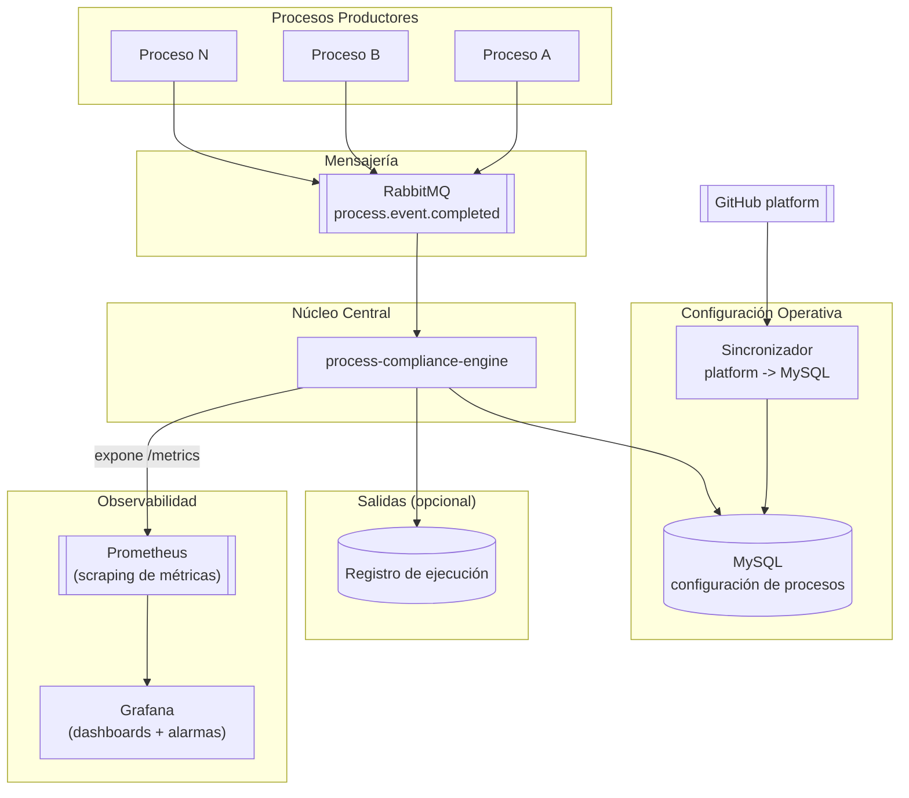

---

# Documento de Arquitectura: Monitoreo de Procesos con Evaluación por Configuración

## 1. Introducción y Contexto

El sistema actual tiene múltiples aplicaciones distribuidas en stacks tecnológicos heterogéneos que se ejecutan de forma programada en Kubernetes CronJobs o lambdas.

La necesidad evoluciona desde reportería hacia monitoreo de procesos. El reporte es un resultado final; lo importante es validar la ejecución completa del proceso contra reglas de negocio y operación.

### Problema a resolver

- Dispersión: no existe un punto central para validar el cierre de procesos.
- Cobertura limitada: se observa el reporte final, pero no la gobernanza del proceso.
- Falta de control operativo: no hay evaluación consistente por reglas, SLA y destino esperado.

---

## 2. Solución Propuesta (Simple)

Arquitectura simple y directa:

1. Un proceso termina y publica un evento en RabbitMQ.
2. process-compliance-engine consume ese evento.
3. process-compliance-engine consulta MySQL con la configuración del proceso.
4. process-compliance-engine evalúa reglas y envía alertas según el caso.



---

## 3. Componentes

### A. Procesos Productores

Cada proceso publica un único evento cuando termina (éxito o fallo). No necesita conocer la lógica de monitoreo.

### B. RabbitMQ (`process.event.completed`)

Canal único de recepción de eventos de cierre de proceso.

- Desacopla productores del monitor central.
- Permite escalar sin cambiar contratos por aplicación.

### C. process-compliance-engine

Componente central que:

- Consume eventos de finalización.
- Busca la configuración del proceso en MySQL.
- Evalúa reglas de validación.
- Registra resultado y dispara alertas cuando aplica.
- **Expone métricas en el endpoint `/metrics`** en formato Prometheus (Micrometer o cliente equivalente).

### D. MySQL como fuente de información operativa

MySQL es la fuente que consulta process-compliance-engine en tiempo de ejecución.

- No se consulta platform de forma directa al evaluar eventos.
- La configuración llega a MySQL por sincronización automática o a demanda.

### E. Sincronizador platform -> MySQL

Servicio o job que mantiene MySQL actualizado desde platform.

- Modo automático: por schedule o webhook.
- Modo a demanda: ejecución manual/API cuando se requiera refrescar.

---

## 4. Contrato mínimo del evento

Campos recomendados para `process.event.completed`:

- processKey
- executionId
- finishedAt
- status (`SUCCESS` o `FAILED`)
- durationMs
- sourceSystem
- errorCode (opcional)
- errorMessage (opcional)

Ejemplo:

```json
{
  "processKey": "asiento-cero-diario",
  "executionId": "exec-20260619-001",
  "finishedAt": "2026-06-19T08:12:00Z",
  "status": "SUCCESS",
  "durationMs": 540000,
  "sourceSystem": "asiento-cero-hub"
}
```

---

## 5. Métricas expuestas

process-compliance-engine expone métricas en formato Prometheus a través del endpoint `/metrics`.
Prometheus realiza scraping periódico de ese endpoint. Grafana consume Prometheus como datasource y sobre esas métricas se configuran los dashboards y las alarmas.

### Métricas recomendadas

| Métrica | Tipo | Descripción |
|---|---|---|
| `pce_events_received_total` | Counter | Total de eventos recibidos desde RabbitMQ |
| `pce_events_evaluated_total` | Counter | Total de eventos evaluados (etiqueta: `result=ok\|fail`) |
| `pce_events_unknown_process_total` | Counter | Eventos de procesos sin configuración en MySQL |
| `pce_rule_violations_total` | Counter | Violaciones de reglas (etiqueta: `rule_type`, `severity`) |
| `pce_sla_exceeded_total` | Counter | Ejecuciones que superaron el SLA configurado |
| `pce_evaluation_duration_seconds` | Histogram | Tiempo de evaluación por evento |
| `pce_mysql_query_duration_seconds` | Histogram | Tiempo de consulta a MySQL por evaluación |

### Alarmas configuradas en Grafana

Las alarmas se definen en Grafana sobre queries PromQL ejecutadas contra Prometheus:

- **Alta tasa de fallos**: `rate(pce_events_evaluated_total{result="fail"}[5m]) > umbral`
- **SLA excedido sostenido**: `increase(pce_sla_exceeded_total[15m]) > 0`
- **Proceso sin configuración**: `increase(pce_events_unknown_process_total[5m]) > 0`
- **Violación crítica**: `increase(pce_rule_violations_total{severity="CRITICAL"}[5m]) > 0`
- **Latencia de evaluación alta**: `histogram_quantile(0.95, pce_evaluation_duration_seconds) > 2`

---

## 6. Reglas de evaluación en process-compliance-engine

Reglas mínimas sugeridas:

1. Proceso no configurado en MySQL: alerta de configuración.
2. Estado `FAILED`: alerta crítica.
3. SLA excedido: alerta de cumplimiento.
4. Evento con contrato incompleto o inválido: alerta de integridad de contrato.
5. Evento duplicado por `executionId`: deduplicar y registrar.

Nota de alcance:

- La validación de entrega/destino final del artefacto (S3, SFTP, email) no es responsabilidad de esta aplicación.
- Esa validación debe ejecutarse en el productor o en un servicio dedicado de auditoría de entrega.

---

## 6. Modelo mínimo en MySQL

Tablas base recomendadas:

- `process_definition`
  - process_key
  - active
  - sla_minutes
  - owner
  - severity

- `process_rule`
  - process_key
  - rule_type
  - threshold
  - enabled

- `process_execution`
  - execution_id
  - process_key
  - status
  - finished_at
  - duration_ms
  - payload_json
  - evaluation_result

- `config_sync_audit`
  - source
  - synced_at
  - sync_mode (`AUTO` / `ON_DEMAND`)
  - result

---

## 7. Estrategia de alertamiento

El sistema combina dos mecanismos complementarios de alarmas:

### Alertas de negocio (desde process-compliance-engine)

Disparadas directamente por la evaluación de reglas, en tiempo real por cada evento procesado.

Severidades:

- INFO
- WARNING
- CRITICAL

Canales:

- Email
- Slack
- Pager (opcional para procesos críticos)

### Alarmas operativas (desde Grafana sobre métricas Prometheus)

Disparadas por condiciones observadas en las métricas del sistema. Permiten detectar degradación, acumulación de fallos o silencio anómalo de procesos que no depende de un único evento.

Canales de notificación configurados en Grafana:

- Slack (canal de operaciones)
- Email (on-call / equipo de turno)
- PagerDuty (procesos críticos)

Buenas prácticas:

- Deduplicar por `executionId`.
- Aplicar ventana de enfriamiento para evitar spam de alertas repetidas.

---

## 8. Beneficios

- Simplicidad operativa: un único evento de fin por proceso.
- Evaluación consistente: reglas centralizadas contra configuración en MySQL.
- Desacoplamiento: productores solo publican evento; monitoreo central decide.
- Evolución controlada: platform sigue siendo origen de configuración, MySQL es fuente operativa en runtime.
- Observabilidad integrada: métricas expuestas en Prometheus permiten configurar dashboards y alarmas en Grafana sin instrumentación adicional en los productores.

En resumen, se pasa de monitoreo de reportes a monitoreo de procesos con una implementación simple, gobernable y escalable.